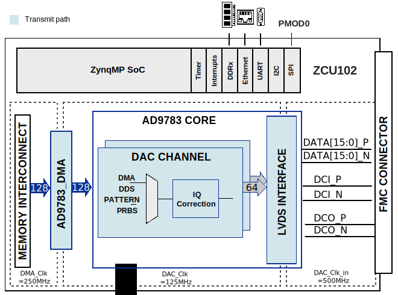
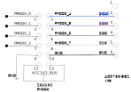

.. _ad9783_ebz_hdl:

AD9783-EBZ HDL project
===============================================================================

Overview
-------------------------------------------------------------------------------

The :part:`AD9783` includes pin-compatible, high dynamic range, dual
digital-to-analog converters (DACs) with 16-bit resolution, and sample rates of
up to 500 MSPS.

The device includes specific features for direct conversion transmit
applications, including gain and offset compensation, interfacing seamlessly
with analog quadrature modulators.

The :part:`EVAL-AD9783` board is connected to the FPGA carrier through
:part:`AD-DAC-FMC`-ADP interposer board.

Supported boards
-------------------------------------------------------------------------------

-  :part:`EVAL-AD9783`

Supported devices
-------------------------------------------------------------------------------

-  :part:`AD9783`

Supported carriers
-------------------------------------------------------------------------------

-  :xilinx:`ZCU102` on FMC HPC0 slot

Block design
-------------------------------------------------------------------------------

Block diagram
~~~~~~~~~~~~~~~~~~~~~~~~~~~~~~~~~~~~~~~~~~~~~~~~~~~~~~~~~~~~~~~~~~~~~~~~~~~~~~~

The data path and clock domains are depicted in the below diagram:

Clock scheme
~~~~~~~~~~~~~~~~~~~~~~~~~~~~~~~~~~~~~~~~~~~~~~~~~~~~~~~~~~~~~~~~~~~~~~~~~~~~~~~

-  External clock source connected to J1 (CLOCK IN)
-  For maximum performance, give a 500 MHz clock

Description of components
~~~~~~~~~~~~~~~~~~~~~~~~~~~~~~~~~~~~~~~~~~~~~~~~~~~~~~~~~~~~~~~~~~~~~~~~~~~~~~~

To make the connection between the :part:`EVAL-AD9783` evaluation board and
the carrier using SPI, some hardware changes must be done to the evaluation
board. These are presented in detail in the **Connections and hardware changes**
section.

SPI connections
~~~~~~~~~~~~~~~~~~~~~~~~~~~~~~~~~~~~~~~~~~~~~~~~~~~~~~~~~~~~~~~~~~~~~~~~~~~~~~~

For the evaluation board to communicate through SPI with the carrier, some
hardware changes must be done, which are explained in the system level
documentation.

.. list-table::
   :widths: 10 20 20 20 20 10
   :header-rows: 1

   * - SPI type
     - SPI manager instance
     - Alias
     - Address
     - SPI subordinate
     - CS nb
   * - PS
     - SPI 0
     - spi_fpga
     - 0xFF040000
     - AD9783
     - 0

CPU/Memory interconnects addresses
~~~~~~~~~~~~~~~~~~~~~~~~~~~~~~~~~~~~~~~~~~~~~~~~~~~~~~~~~~~~~~~~~~~~~~~~~~~~~~~

============== ==========
Instance       Address
============== ==========
axi_ad9783     0x74200000
axi_ad9783_dma 0x7C420000
============== ==========

Interrupts
~~~~~~~~~~~~~~~~~~~~~~~~~~~~~~~~~~~~~~~~~~~~~~~~~~~~~~~~~~~~~~~~~~~~~~~~~~~~~~~

Below are the Programmable Logic interrupts used in this project.

============== === ============ =============
Instance name  HDL Linux ZynqMP Actual ZynqMP
============== === ============ =============
axi_ad9783_dma 12  108          140
============== === ============ =============

Building the HDL project
-------------------------------------------------------------------------------

The design is built upon ADI's generic HDL reference design framework.
ADI does not distribute the bit/elf files of these projects so they
must be built from the sources available :git-hdl:`here <master:/>`. To get
the source you must
`clone <https://git-scm.com/book/en/v2/Git-Basics-Getting-a-Git-Repository>`__
the HDL repository, and then build the project as follows:

**Linux/Cygwin/WSL**

.. code-block::

   user@analog:~$ cd hdl/projects/ad9783_ebz/zcu102
   user@analog:~/hdl/projects/ad9783_ebz/zcu102$ make

A more comprehensive build guide can be found in the :ref:`build_hdl` user guide.

Software considerations
-------------------------------------------------------------------------------

The SPI communication is changed because of hardware modifications, so the
connection looks like this:

|ad9783_zcu102_spi_pmod.svg|

Resources
-------------------------------------------------------------------------------

Hardware related
~~~~~~~~~~~~~~~~~~~~~~~~~~~~~~~~~~~~~~~~~~~~~~~~~~~~~~~~~~~~~~~~~~~~~~~~~~~~~~~

-  Product datasheets:

   -  :part:`AD9783`
   -  :part:`EVAL-AD9783`
   -  :part:`AD-DAC-FMC`-ADP

HDL related
~~~~~~~~~~~~~~~~~~~~~~~~~~~~~~~~~~~~~~~~~~~~~~~~~~~~~~~~~~~~~~~~~~~~~~~~~~~~~~~

-  :git-hdl:`AXI_AD9783 <master:library/axi_ad9783>`
-  :git-hdl:`AD9783_EBZ HDL project <master:projects/ad9783_ebz>`

-  :git-hdl:`AXI_DMAC <master:library/axi_dmac>`
-  :git-hdl:`AXI_SYSID <master:library/axi_sysid>`
-  :git-hdl:`SYSID_ROM <master:library/sysid_rom>`
-  :git-hdl:`UTIL_UPACK2 <master:library/util_pack/util_upack2>`

-  :dokuwiki:`[Wiki] AD9783-EBZ Quick Start Guide <resources/fpga/xilinx/interposer/ad9783>`

-  :ref:`AXI_DMAC <axi_dmac>`
-  :dokuwiki:`AXI_SYSID and SYSID_ROM <resources/fpga/docs/axi_sysid>`
-  :dokuwiki:`[Wiki] UTIL_CPACK2 (Channel CPACK Utility Core) <resources/fpga/docs/util_cpack>`

Software related
~~~~~~~~~~~~~~~~~~~~~~~~~~~~~~~~~~~~~~~~~~~~~~~~~~~~~~~~~~~~~~~~~~~~~~~~~~~~~~~

-  :git-linux:`Linux device tree zynqmp-zcu102-rev10-ad9783.dts <master:arch/arm64/boot/dts/xilinx/zynqmp-zcu102-rev10-ad9783.dts>`
-  :git-linux:`Linux driver ad9783.c <master:drivers/iio/frequency>`

Systems related
~~~~~~~~~~~~~~~~~~~~~~~~~~~~~~~~~~~~~~~~~~~~~~~~~~~~~~~~~~~~~~~~~~~~~~~~~~~~~~~

-  :dokuwiki:`[Wiki] AD9783-EBZ Quick Start Guide <resources/fpga/xilinx/interposer/ad9783>`

.. include:: ../common/more_information.rst

.. include:: ../common/support.rst

