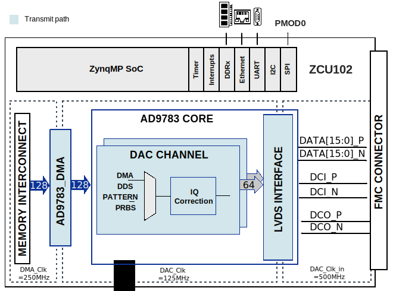

:orphan:

.. _template_project:

Project template
================================================================================

Overview
-------------------------------------------------------------------------------

**\*Some specifications about the board, the chip, etc. Typically the
information found on the** https://www.analog.com/en/products/
**website**\ \*

Supported boards
-------------------------------------------------------------------------------

**\*IF IT APPLIES**\ \*

-  :part:`AD9081-FMCA-EBZ <EVAL-AD9081>`
-  :part:`AD9082-FMCA-EBZ <EVAL-AD9082>`

Supported devices
-------------------------------------------------------------------------------

**\*EXAMPLES**\ \*

-  :part:`AD9081`
-  :part:`AD9177`
-  :part:`AD9209`

Supported carriers
-------------------------------------------------------------------------------

**\*At least one. Should be updated each time the project is ported to
another carrier**\ \*

Block design
-------------------------------------------------------------------------------

Configuration modes
~~~~~~~~~~~~~~~~~~~~~~~~~~~~~~~~~~~~~~~~~~~~~~~~~~~~~~~~~~~~~~~~~~~~~~~~~~~~~~~

\**\* MENTION IF ANY MODES ARE AVAILABLE FOR CONFIGURATION \**\*

Block diagram
~~~~~~~~~~~~~~~~~~~~~~~~~~~~~~~~~~~~~~~~~~~~~~~~~~~~~~~~~~~~~~~~~~~~~~~~~~~~~~~

\**\* MUST HAVE \**\* The data path and clock domains are depicted in
the below diagram:

\*\* TIP: upload the .svg file for the diagram to have high quality \*\*

Clock scheme
~~~~~~~~~~~~~~~~~~~~~~~~~~~~~~~~~~~~~~~~~~~~~~~~~~~~~~~~~~~~~~~~~~~~~~~~~~~~~~~

-  External clock source
   :dokuwiki:`AD-SYNCHRONA14-EBZ <resources/eval/user-guides/ad-synchrona14-ebz>`
-  SYSREF clocks are LVDS
-  ADCCLK and REFCLK are LVPECL

\*\* ADD IMAGE IF APPLIES! TIP: upload the .svg file for the diagram to have
high quality \*\*

Description of components
~~~~~~~~~~~~~~~~~~~~~~~~~~~~~~~~~~~~~~~~~~~~~~~~~~~~~~~~~~~~~~~~~~~~~~~~~~~~~~~

**\*OTHER COMPONENTS FROM THE PROJECT, EX: SYNCHRONA**\ \*

Only the channels presented in the clocking selection are relevant. For
the rest, you can either disable them or just put a divided frequency of
the source clock.

Configuration of components
^^^^^^^^^^^^^^^^^^^^^^^^^^^^^^^^^^^^^^^^^^^^^^^^^^^^^^^^^^^^^^^^^^^^^^^^^^^^^^^

Limitations
^^^^^^^^^^^^^^^^^^^^^^^^^^^^^^^^^^^^^^^^^^^^^^^^^^^^^^^^^^^^^^^^^^^^^^^^^^^^^^^

**\*EXAMPLE OF CONFIGURATION/LIMITATION. PLEASE WRITE THIS KIND OF
INFORMATION IF IT APPLIES TO THE PROJECT**\ \*

The design has one JESD receive chain with 4 lanes at rate of 13Gbps.
The JESD receive chain consists of a physical layer represented by an
XCVR module, a link layer represented by an RX JESD LINK module and
transport layer represented by a RX JESD TPL module. The link operates
in Subclass 1.

The link is set for full bandwidth mode and operate with the following
parameters:

Deframer paramaters: L=4, M=2, F=1, S=1, NP=16

| SYSREF - 5.078125 MHZ
| REFCLK - 325MHz (Lane Rate/40)
| DEVICECLK - 325 MHz
| ADCCLK - 1300MHz
| JESD204B Lane Rate - 13Gbps

The transport layer component presents on its output 128 bits at once on
every clock cycle, representing 4 samples per converter. The two receive
chains are merged together and transferred to the DDR with a single DMA.

I2C connections
~~~~~~~~~~~~~~~~~~~~~~~~~~~~~~~~~~~~~~~~~~~~~~~~~~~~~~~~~~~~~~~~~~~~~~~~~~~~~~~

.. list-table::
   :widths: 20 20 20 20 20
   :header-rows: 1

   * - I2C type
     - I2C manager instance
     - Alias
     - Address
     - I2C subordinate
   * -
     -
     -
     -
     -

SPI connections
~~~~~~~~~~~~~~~~~~~~~~~~~~~~~~~~~~~~~~~~~~~~~~~~~~~~~~~~~~~~~~~~~~~~~~~~~~~~~~~

THESE ARE JUST EXAMPLES!!!
USE WHICHEVER FITS BEST YOUR CASE

.. list-table::
   :widths: 10 20 20 20 20 10
   :header-rows: 1

   * - SPI type
     - SPI manager instance
     - Alias
     - Address
     - SPI subordinate
     - CS nb
   * - PS
     - SPI 0
     - spi_fpga
     - 0xFF040000
     - ADXYZT
     - 0
   * - PS
     - SPI 1
     - spi_bus_0
     - 0xFF050000
     - AD0000
     - 0
   * - PL
     - axi_spi_bus_1
     - spi_bus_1
     - 0x48000000
     - AD23456
     - 0

GPIOs
~~~~~~~~~~~~~~~~~~~~~~~~~~~~~~~~~~~~~~~~~~~~~~~~~~~~~~~~~~~~~~~~~~~~~~~~~~~~~~~

The Software GPIO number is calculated as follows:

-  Zynq-7000: when PS7 is used, the offset is 54
-  Zynq UltraScale: when PS8 is used, the offset is 78

.. list-table::
   :widths: 25 20 20 20 15
   :header-rows: 2

   * - GPIO signal
     - Direction
     - HDL GPIO EMIO 32
     - Software GPIO nb
     - Software GPIO nb
   * -
     - (from FPGA perspectve)
     -
     - Zynq-7000
     - Zynq UltraScale
   * - gpio[0:10]
     - INOUT
     - 32-42
     - 86-96
     - 110-120
   * - agc0[0:1]
     - IN
     - 44, 45
     - 98, 99
     - 122, 123
   * - hmc_sync
     - OUT
     - 54
     - 108
     - 132

CPU/Memory interconnects addresses
~~~~~~~~~~~~~~~~~~~~~~~~~~~~~~~~~~~~~~~~~~~~~~~~~~~~~~~~~~~~~~~~~~~~~~~~~~~~~~~

\**\* THIS IS JUST AN EXAMPLE \**\*

=========== ==========
Instance    Address
=========== ==========
axi_ad4858  0x43c00000
axi_pwm_gen 0x43d00000
ad4858_dma  0x43e00000
adc_clkgen  0x44000000
=========== ==========

\**\* THIS IS JUST AN EXAMPLE \**\*

Depending on the values of parameters $INTF_CFG, $ADI_PHY_SEL and $TDD_SUPPORT,
some IPs are instatiated and some are not.

Check-out the table below to find out the conditions.

==================== ================================= ===========
Instance             Depends on parameter              Address
==================== ================================= ===========
axi_mxfe_rx_xcvr     $INTF_CFG!="TX" & $ADI_PHY_SEL==1 0x44A6 0000
rx_mxfe_tpl_core     $INTF_CFG!="TX"                   0x44A1 0000
axi_mxfe_rx_jesd     $INTF_CFG!="TX"                   0x44A9 0000
axi_mxfe_rx_dma      $INTF_CFG!="TX"                   0x7C42 0000
mxfe_rx_data_offload $INTF_CFG!="TX"                   0x7C45 0000
axi_mxfe_tx_xcvr     $INTF_CFG!="RX" & $ADI_PHY_SEL==1 0x44B6 0000
tx_mxfe_tpl_core     $INTF_CFG!="RX"                   0x44B1 0000
axi_mxfe_tx_jesd     $INTF_CFG!="RX"                   0x44B9 0000
axi_mxfe_tx_dma      $INTF_CFG!="RX"                   0x7C43 0000
mxfe_tx_data_offload $INTF_CFG!="RX"                   0x7C44 0000
axi_tdd_0            $TDD_SUPPORT==1                   0x7C46 0000
==================== ================================= ===========

Interrupts
~~~~~~~~~~~~~~~~~~~~~~~~~~~~~~~~~~~~~~~~~~~~~~~~~~~~~~~~~~~~~~~~~~~~~~~~~~~~~~~

Below are the Programmable Logic interrupts used in this project.

You have many ways of writing this table: as a list-table or really to draw
it. Take a look in the .rst of this page to see how they're written and
which suits best your case.

.. list-table::
   :widths: 30 10 15 15 15 15
   :header-rows: 1

   * - Instance name
     - HDL
     - Linux Zynq
     - Actual Zynq
     - Linux ZynqMP
     - Actual ZynqMP
   * - ---
     - 15
     - 59
     - 91
     - 111
     - 143
   * - ---
     - 14
     - 58
     - 90
     - 110
     - 142
   * - ---
     - 13
     - 57
     - 89
     - 109
     - 141
   * - ---
     - 12
     - 56
     - 88
     - 108
     - 140
   * - ---
     - 11
     - 55
     - 87
     - 107
     - 139
   * - ---
     - 10
     - 54
     - 86
     - 106
     - 138
   * - ---
     - 9
     - 53
     - 85
     - 105
     - 137
   * - ---
     - 8
     - 52
     - 84
     - 104
     - 136
   * - ---
     - 7
     - 36
     - 68
     - 96
     - 128
   * - ---
     - 6
     - 35
     - 67
     - 95
     - 127
   * - ---
     - 5
     - 34
     - 66
     - 94
     - 126
   * - ---
     - 4
     - 33
     - 65
     - 93
     - 125
   * - ---
     - 3
     - 32
     - 64
     - 92
     - 124
   * - ---
     - 2
     - 31
     - 63
     - 91
     - 123
   * - ---
     - 1
     - 30
     - 62
     - 90
     - 122
   * - ---
     - 0
     - 29
     - 61
     - 89
     - 121

================ === ========== =========== ============ ============= ====== =============== ================
Instance name    HDL Linux Zynq Actual Zynq Linux ZynqMP Actual ZynqMP S10SoC Linux Cyclone V Actual Cyclone V
================ === ========== =========== ============ ============= ====== =============== ================
---              15  59         91          111          143           32     55              87
---              14  58         90          110          142           31     54              86
---              13  57         89          109          141           30     53              85
---              12  56         88          108          140           29     52              84
---              11  55         87          107          139           28     51              83
---              10  54         86          106          138           27     50              82
---              9   53         85          105          137           26     49              81
---              8   52         84          104          136           25     48              80
---              7   36         68          96           128           24     47              79
---              6   35         67          95           127           23     46              78
---              5   34         66          94           126           22     45              77
---              4   33         65          93           125           21     44              76
---              3   32         64          92           124           20     43              75
---              2   31         63          91           123           19     42              74
---              1   30         62          90           122           18     41              73
---              0   29         61          89           121           17     40              72
================ === ========== =========== ============ ============= ====== =============== ================

============= === ========== =========== ============ =============
Instance name HDL Linux Zynq Actual Zynq Linux ZynqMP Actual ZynqMP
============= === ========== =========== ============ =============
---           15  59         91          111          143
---           14  58         90          110          142
---           13  57         89          109          141
---           12  56         88          108          140
---           11  55         87          107          139
---           10  54         86          106          138
---           9   53         85          105          137
---           8   52         84          104          136
---           7   36         68          96           128
---           6   35         67          95           127
---           5   34         66          94           126
---           4   33         65          93           125
---           3   32         64          92           124
---           2   31         63          91           123
---           1   30         62          90           122
---           0   29         61          89           121
============= === ========== =========== ============ =============

!!!! These are the project-specific interrupts (usually found in
/project_name/common/Project_name_bd,tcl).
Add the name of the component that uses that interrupt.
Delete the dropdown section when you insert the table in your page

NOTE THAT FOR ULTRASCALE\+ DEVICES, THE PS I2C IS NOT SUPPORTED IN LINUX!!
ALWAYS USE PL I2C FOR THESE DESIGNS!!

Building the HDL project
-------------------------------------------------------------------------------

**\*YOU CAN KEEP THE FIRST PARAGRAPH SINCE IT IS GENERIC**\ \*

The design is built upon ADI's generic HDL reference design framework.
ADI does not distribute the bit/elf files of these projects so they
must be built from the sources available :git-hdl:`here <master:/>`. To get
the source you must
`clone <https://git-scm.com/book/en/v2/Git-Basics-Getting-a-Git-Repository>`__
the HDL repository.

Then go to the **\*PROJECT LOCATION WITHIN HDL (EX:
projects/ad9695/zcu102)**\ \* location and run the make command by
typing in your command prompt:

**Linux/Cygwin/WSL**

**\*Say which is the default configuration that's built when running
``make``, give examples of running with all parameters and also with
just one. Say that it will create a folder with the name ... when
running with the following parameters.**\ \*

.. code-block::
   :linenos:
   :emphasize-lines: 2, 6

   user@analog:~$ cd hdl/projects/ad9081_fmca_ebz/zcu102
   // these are just examples of how to write the *make* command with parameters
   user@analog:~/hdl/projects/ad9081_fmca_ebz/zcu102$ make parameter1=value parameter2=value

   user@analog:~$ cd hdl/projects/ad9081_fmca_ebz/a10soc
   // these are just examples of how to write the *make* command with parameters
   user@analog:~/hdl/projects/ad9081_fmca_ebz/a10soc$ make RX_LANE_RATE=2.5 TX_LANE_RATE=2.5 RX_JESD_L=8 RX_JESD_M=4 RX_JESD_S=1 RX_JESD_NP=16 TX_JESD_L=8 TX_JESD_M=4 TX_JESD_S=1 TX_JESD_NP=16

The following dropdowns contain tables with the parameters that can be used to
configure this project, depending on the carrier used.
Where a cell contains a --- (dash) it means that the parameter doesn't exist
for that project (ad9081_fmca_ebz/carrier or ad9082_fmca_ebz/carrier).

.. dropdown:: Default values of the ``make`` parameters for AD9082-FMCA-EBZ

   +-------------------+-----------------------------------------------+
   | Parameter         | Default value of the parameters               |
   |                   |            depending on carrier               |
   |                   +--------+--------+--------------+--------------+
   |                   | VCK190 | VCU118 |        ZC706 |       ZCU102 |
   +===================+========+========+==============+==============+
   | JESD_MODE         | 64B66B |  8B10B | :red:`8B10B*`| :red:`8B10B*`|
   +-------------------+--------+--------+--------------+--------------+
   | RX_LANE_RATE      |  24.75 |     15 |           10 |           15 |
   +-------------------+--------+--------+--------------+--------------+
   | TX_LANE_RATE      |  24.75 |     15 |           10 |           15 |
   +-------------------+--------+--------+--------------+--------------+
   | REF_CLK_RATE      |    375 |    --- |          --- |          --- |
   +-------------------+--------+--------+--------------+--------------+
   | RX_JESD_M         |      4 |      4 |            8 |            4 |
   +-------------------+--------+--------+--------------+--------------+
   | RX_JESD_L         |      8 |      8 |            4 |            8 |
   +-------------------+--------+--------+--------------+--------------+
   | RX_JESD_S         |      4 |      1 |            1 |            1 |
   +-------------------+--------+--------+--------------+--------------+
   | RX_JESD_NP        |     12 |     16 |           16 |           16 |
   +-------------------+--------+--------+--------------+--------------+
   | RX_NUM_LINKS      |      1 |      1 |            1 |            1 |
   +-------------------+--------+--------+--------------+--------------+
   | RX_TPL_WIDTH      |    --- |    --- |          --- |           {} |
   +-------------------+--------+--------+--------------+--------------+
   | TX_JESD_M         |      4 |      4 |            8 |            4 |
   +-------------------+--------+--------+--------------+--------------+
   | TX_JESD_L         |      8 |      8 |            4 |            8 |
   +-------------------+--------+--------+--------------+--------------+
   | TX_JESD_S         |      8 |      1 |            1 |            1 |
   +-------------------+--------+--------+--------------+--------------+
   | TX_JESD_NP        |     12 |     16 |           16 |           16 |
   +-------------------+--------+--------+--------------+--------------+
   | TX_NUM_LINKS      |      1 |      1 |            1 |            1 |
   +-------------------+--------+--------+--------------+--------------+
   | TX_TPL_WIDTH      |    --- |    --- |          --- |           {} |
   +-------------------+--------+--------+--------------+--------------+
   | RX_KS_PER_CHANNEL |     64 |     64 |          --- |          --- |
   +-------------------+--------+--------+--------------+--------------+
   | TX_KS_PER_CHANNEL |     64 |     64 |          --- |          --- |
   +-------------------+--------+--------+--------------+--------------+

   .. warning::

      ``*`` --- for this carrier only the 8B10B mode is supported

The result of the build, if parameters were used, will be in a folder named
by the configuration used:

if the following command was run

``make RX_LANE_RATE=2.5 TX_LANE_RATE=2.5 RX_JESD_L=8 RX_JESD_M=4 RX_JESD_S=1 RX_JESD_NP=16 TX_JESD_L=8 TX_JESD_M=4 TX_JESD_S=1 TX_JESD_NP=16``

then the folder name will be:

``RXRATE2_5_TXRATE2_5_RXL8_RXM4_RXS1_RXNP16_TXL8_TXM4_TXS1_TXNP16``
because of truncation of some keywords so the name will not exceed the limits
of the Operating System (``JESD``, ``LANE``, etc. are removed) of 260
characters.

**\*KEEP THIS LINE TOO**\ \*
A more comprehensive build guide can be found in the :ref:`build_hdl` user guide.

Software considerations
-------------------------------------------------------------------------------

\**\* MENTION THESE \**\*

ADC - crossbar config \**\* THIS IS JUST AN EXAMPLE \**\*
~~~~~~~~~~~~~~~~~~~~~~~~~~~~~~~~~~~~~~~~~~~~~~~~~~~~~~~~~~~~~~~~~~~~~~~~~~~~~~~

Due to physical constraints, Rx lanes are reordered as described in the
following table.

e.g physical lane 2 from ADC connects to logical lane 7
from the FPGA. Therefore the crossbar from the device must be set
accordingly.

============ ===========================
ADC phy Lane FPGA Rx lane / Logical Lane
============ ===========================
0            2
1            0
2            7
3            6
4            5
5            4
6            3
7            1
============ ===========================

DAC - crossbar config \**\* THIS IS JUST AN EXAMPLE \**\*
~~~~~~~~~~~~~~~~~~~~~~~~~~~~~~~~~~~~~~~~~~~~~~~~~~~~~~~~~~~~~~~~~~~~~~~~~~~~~~~

Due to physical constraints, Tx lanes are reordered as described in the
following table:

e.g physical lane 2 from DAC connects to logical lane 7
from the FPGA. Therefore the crossbar from the device must be set
accordingly.

============ ===========================
DAC phy Lane FPGA Tx lane / Logical Lane
============ ===========================
0            0
1            2
2            7
3            6
4            1
5            5
6            4
7            3
============ ===========================

Resources
-------------------------------------------------------------------------------

Hardware related
~~~~~~~~~~~~~~~~~~~~~~~~~~~~~~~~~~~~~~~~~~~~~~~~~~~~~~~~~~~~~~~~~~~~~~~~~~~~~~~

-  Product datasheets:

   -  :part:`AD9081`
   -  :part:`AD9082`
   -  :part:`AD9988`
   -  :part:`AD9986`
-  `UG-1578, Device User Guide <https://www.analog.com/media/en/technical-documentation/user-guides/ad9081-ad9082-ug-1578.pdf>`__
-  `UG-1829, Evaluation Board User Guide <https://www.analog.com/media/en/technical-documentation/user-guides/ad9081-fmca-ebz-9082-fmca-ebz-ug-1829.pdf>`__

HDL related
~~~~~~~~~~~~~~~~~~~~~~~~~~~~~~~~~~~~~~~~~~~~~~~~~~~~~~~~~~~~~~~~~~~~~~~~~~~~~~~

-  Links to the code of the specific IPs (eg. library/axi_ad9783)
-  Link to the code of the project (eg. projects/ad9081_fmca_ebz)

-  Links to the code of the IPs used in this project (eg. library/util_pack/util_cpack2)

-  Link to the documentation of axi_ad9783
-  Links to the documentation of the IPs used in this project

-  Other relevant HDL documents to the project, like:

   -  :dokuwiki:`Generic JESD204B block designs <resources/fpga/docs/hdl/generic_jesd_bds>`
   -  :dokuwiki:`JESD204B High-Speed Serial Interface Support <resources/fpga/peripherals/jesd204>`

Software related
~~~~~~~~~~~~~~~~~~~~~~~~~~~~~~~~~~~~~~~~~~~~~~~~~~~~~~~~~~~~~~~~~~~~~~~~~~~~~~~

\**\* THIS IS JUST AN EXAMPLE \**\*

-  :dokuwiki:`[Wiki] AD9081-FMCA-EBZ Linux driver wiki page <resources/tools-software/linux-drivers/iio-mxfe/ad9081>`

If there is no Linux driver page, then insert a link to the code of the driver
and of the device tree.

-  Python support (THIS IS JUST AN EXAMPLE):

   -  `AD9081 class documentation <https://analogdevicesinc.github.io/pyadi-iio/devices/adi.ad9081.html>`__
   -  `PyADI-IIO documentation <https://analogdevicesinc.github.io/pyadi-iio/>`__

Systems related
~~~~~~~~~~~~~~~~~~~~~~~~~~~~~~~~~~~~~~~~~~~~~~~~~~~~~~~~~~~~~~~~~~~~~~~~~~~~~~~

-  Links to the Quick start guides, to the pages where the hardware changes are
   specified in detail, etc.

\**\* THIS IS JUST AN EXAMPLE \**\*

-  :dokuwiki:`AD9081 Quick Start Guides <resources/eval/user-guides/ad9081_fmca_ebz/quickstart>`

-  Other relevant information

.. include:: ../common/more_information.rst

.. include:: ../common/support.rst
